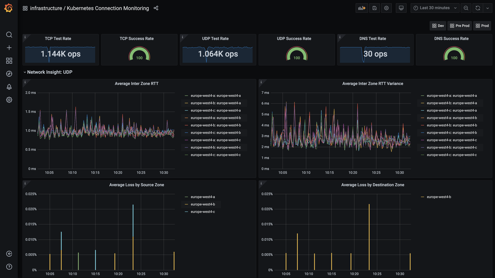

# kmoncon - Monitoring connectivity between your kubernetes nodes

A Kubernetes node connectivity tool that preforms frequent tests (tcp, udp and dns), and exposes [Prometheus](https://prometheus.io) metrics that are enriched with the node name, and the locality information (such as zone), enabling you to correlate issues between availability zones or nodes.

The idea is this information supplements any other L7 monitoring you use, such as [Istio](https://istio.io/latest/docs/concepts/observability) observability or [Kube State Metrics](https://github.com/kubernetes/kube-state-metrics), to help you get to the root cause of a problem faster.

It's really performant, considering the number of tests it is doing, on my clusters of 75 nodes, the agents have a mere 60m CPU/40mb RAM resource request.

Once you've got it up and going, you can plot some pretty dashboards like this:



PS. I've included a sample dashboard [here](grafana-dashboard.json) to get you going

**Known Issues**:

- It's super, mega pre-alpha, the product of a weekends experimentation - so don't expect it to be perfect. I plan to improve it but wanted to get something out there to people who wanted it.
- It's written in [nodejs](https://nodejs.org/en) which means the docker image is 130mb. That's not huge, but it isn't golang small either.
- If you've got nodes coming up and down frequently, eventual consistency means that you might get some test failures as an agent is testing a node that's gone (but is yet to get an updated agent list). I plan to tackle this with push agent updates.

## Architecture

The application consists of two components.

### Agent

This agent runs a [Daemonset](https://kubernetes.io/docs/concepts/workloads/controllers/daemonset) agent on [Kubernetes](https://kubernetes.io/) clusters, and requires minimal permissions to run. The agents purpose is to periodically run tests against the other agents, and expose the results as metrics.

The agent also spawns with an initContainer, which sets some sysctl tcp optimisations. You can disable this behaviour in the [the helm values file](helmfile/charts/kconmon/values.yaml).

### Controller

In order to discover other agents, and enrich the agent information with metadata about the node and availability zone, the controller constantly watches the kubernetes API and maintains the current state in memory. The agents connect to the controller when they start, to get their own metadata, and then every 5 seconds in order to get an up to date agent list.

**NOTE**: Your cluster needs RBAC enabled as the controller uses in-cluster service-account authentication with the kubernetes master.

## Testing

`kconmon` does a variety of different tests, and exposes the results as prometheus metrics enriched with the node and locality information. The interval is configurable in the [helm chart config](helmfile/charts/kconmon/values.yaml), and is subject to a 50-500ms jitter to spread the load.

### UDP Testing

`kmoncon` agents by default will perform 5 x 4 byte UDP packet tests between every other agent, every 5 seconds. Each test waits for a response from the destination agent. The RTT timeout is 250ms, anything longer than that and we consider the packets lost in the abyss. The metrics output from UDP tests are:

- `GAUGE kconmon_udp_duration_milliseconds`: The total RTT from sending the packet to receiving a response
- `GAUGE kconmon_udp_duration_variance_milliseconds`: The variance between the slowest and the fastest packet
- `GAUGE kconmon_udp_loss`: The percentage of requests from the batch that failed
- `COUNTER kconmon_udp_results_total`: A Counter of test results, pass and fail

### TCP Testing

`kmoncon` angets will perform a since HTTP GET request between every other agent, every 5 seconds. Each connection is terminated with `Connection: close` and [Nagle's Algorithm](https://en.wikipedia.org/wiki/Nagle%27s_algorithm) as disabled to ensure consistency across tests.

The metrics output from TCP tests are:

- `GAUGE kconmon_tcp_connect_milliseconds`: The duration from socket assignment to successful TCP connection
- `GAUGE kconmon_tcp_duration_milliseconds`: The total RTT of the request
- `COUNTER kconmon_tcp_results_total`: A Counter of test results, pass and fail

### DNS Testing

`kconmon` agents will perform DNS tests by defualt every 5 seconds. It's a good idea to have tests for a variety of different resolvers (eg kube-dns, public etc).

The metrics output from DNS tests are:

- `COUNTER kconmon_dns_results_total`: A Counter of test results, pass and fail

## Prometheus Metrics

The agents expose a metric endpoint on `:8080/metrics`, which you'll need to configure Prometheus to scrape. Here is an example scrape config:

```
- job_name: 'kconmon'
  honor_labels: true
  kubernetes_sd_configs:
  - role: pod
    namespaces:
      names:
      - kconmon
  relabel_configs:
  - source_labels: [__meta_kubernetes_pod_label_app, __meta_kubernetes_pod_label_component]
    action: keep
    regex: "(kconmon;agent)"
  - source_labels: [__address__]
    action: replace
    regex: ([^:]+)(?::\d+)?
    replacement: $1:8080
    target_label: __address__
  metric_relabel_configs:
  - regex: "(instance|pod)"
    action: labeldrop
  - source_labels: [__name__]
    regex: "(kconmon_.*)"
    action: keep
```

### Alerting

You could configure some alerts too, like this one which fires when we have consistent TCP test failures between zones for 2 minutes:

```
groups:
- name: kconmon.alerting-rules
  rules:
  - alert: TCPInterZoneTestFailure
    expr: |
      sum(increase(kconmon_tcp_results_total{result="fail"}[1m])) by (source_zone, destination_zone) > 0
    labels:
      for: 2m
      severity: warning
      source: '{{ "{{" }}$labels.source_zone{{ "}}" }}'
    annotations:
      instance: '{{ "{{" }}$labels.destination_zone{{ "}}" }}'
      description: >-
        TCP Test Failures detected between one or more zones
      summary: Inter Zone L7 Test Failure
```

## Deployment

The easiest way to install `kconmon` is with Helm. Head over to the [releases](https://github.com/Stono/kconmon/releases) page to download the latest chart. Check out the [values.yaml](helmfile/charts/kconmon/values.yaml) for all the available configuration options.
